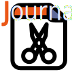

  

# PaperBlade 📄✂️

A browser plugin to transform academic papers into training data for LLMs 🚀🧠

## Introduction 🌟

PaperBlade is a revolutionary browser plugin 🔌 designed to streamline the process of converting academic papers into training data for Large Language Models (LLMs). Whether you're a researcher 🔬, data scientist 📊, or AI enthusiast 🤖, PaperBlade makes it easy to turn complex academic content into valuable training resources.

## Features ✨

- 🔍 Smart Recognition: Automatically detect and extract key sections of papers
- 🗂️ Structured Data: Organize paper content into LLM-friendly formats
- 🔢 Metadata Extraction: Capture crucial bibliographic information like authors, dates, and citations
- 🔗 Citation Linking: Preserve references to original sources for traceability
- 🔄 Batch Processing: Handle multiple papers in one go
- 🛠️ Customization Options: Tailor output to your specific needs

## Installation 💻

🚧 Coming Soon! 🚧
PaperBlade is currently under active development and not yet available for public use. We're working hard to bring this tool to you as soon as possible!

## How to Use 🚀

While PaperBlade is still in development, here's a sneak peek of how it will work:
- Navigate to an academic paper webpage 📃
- Click on the PaperBlade icon ✂️
- Select your desired conversion options ⚙️
- Hit the "Convert" button 🔄
- Download your generated training data 📥

## Contributing 🤝

We welcome contributions of all kinds! Whether it's reporting bugs 🐛, suggesting new features 💡, or submitting code 👨‍💻👩‍💻, your input helps make PaperBlade better.

## License 📜

PaperBlade is released under the GPL-3.0 license.

## Contact Us 📞

Got questions or suggestions? Feel free to reach out:
Email: ✉️ nieqiyang3@gmail.com

Let's push the boundaries of AI research together! 🚀🌠
